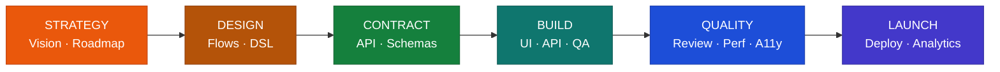

<p align="center">
  
  
  
  
  
</p>

<h1 align="center">Crew</h1>
<h3 align="center">Phase-Based Development Workflow for Claude Code</h3>

<p align="center">
  <strong>20 specialised agents. 6 phases. First-class Gang integration.</strong><br/>
  Drives features from strategy to launch through scoped agents and file-based handoffs —
  with explicit phase gates, contract-first development, and acceptance testing.
</p>

<p align="center">
  <code>/crew onboard</code>
</p>

---

## Quick Start

```bash
# 1. Add the marketplace
claude plugin marketplace add ebnrdwan/Crew

# 2. Install the plugin
claude plugin install crew

# 3. Run on any project
/crew onboard          # existing codebase — auto-detects state, sets phase
/crew init             # new project — starts at Phase 1

# Update to latest version
claude plugin marketplace update crew-marketplace
```

---

## How It Works



| Phase | Focus | Key Agents |
|---|---|---|
| **1. Strategy** | Vision, personas, roadmap | `product-strategist`, `feature-planner` |
| **2. Design** | Flows, design tokens, hi-fi screens | `ux-designer`, `dsl-generator` |
| **2.5. Contract** | API single source of truth | `api-contract-architect` |
| **3. Build** | Frontend + backend + QA in parallel | `ui-engineer`, `api-engineer`, `qa-engineer`, `pm-maestro-reviewer` |
| **4. Quality** | Review, perf, a11y, gap audit | `code-reviewer`, `performance-optimizer`, `a11y-expert`, `gap-finder` |
| **5/6. Launch** | Deploy, analytics, i18n | `devops-engineer`, `post-launch-analyst`, `i18n-engineer` |

Each phase has explicit completion criteria and requires user approval before advancing.

---

## Commands

| Command | What it does |
|---|---|
| `/crew` | Show subcommands and current project status |
| `/crew init` | Initialise a new project at Phase 1 |
| `/crew onboard` | Onboard an existing codebase — detect type, audit, set phase |
| `/crew feature [name]` | Add a feature, create branches, assign agents |
| `/crew setup-mcp [tool]` | Connect external tools (Jira, Notion, Linear, GitHub, …) |
| `/crew drive [name]` | End-to-end product-led feature dev (pm-architect → build → QA → audit) |
| `/crew deploy [flags]` | Pre-deployment checklist with auto-remediation |
| `/crew gaps [url]` | UI gap audit + auto-fix pipeline |
| `/crew features [filters]` | Roadmap dashboard with status, pages, acceptance progress |
| `/crew gang-import <slug>` | Import a Gang GO Package as a Crew feature |
| `/crew gang-escalate <id>` | Send a stalled Crew feature back to Gang for re-scoring |
| `/crew push` | Sync the current feature to GitHub Projects (live status card) |
| `/crew resume [id]` | Resume from a usage-budget checkpoint |
| `/crew profile [check\|set\|list]` | Manage user knowledge profile per tech (one-time per tech, cached) |
| `/crew investigate [topic]` | Hypothesis-driven, time-boxed investigation (creates a spike card) |
| `/crew fix [issue]` | Reproduce → locate → fix → verify a known bug (creates a bug card) |

---

## 20 Specialised Agents

| Phase | Agents |
|---|---|
| **1. Strategy** | `product-strategist`, `feature-planner` |
| **2. Design** | `ux-designer`, `dsl-generator` |
| **2.5. Contract** | `api-contract-architect` |
| **3. Build** | `ui-engineer`, `api-engineer`, `qa-engineer`, `pm-maestro-reviewer` |
| **4. Quality** | `code-reviewer`, `performance-optimizer`, `a11y-expert`, `gap-finder`, `ui-animation-designer` |
| **5. Launch** | `devops-engineer`, `post-launch-analyst` |
| **6. Enhancement** | `i18n-engineer` |
| **Cross-cutting** | `doc-writer`, `pm-architect` |
| **Gang ↔ Crew** | `gang-bridge` |

The `ui-engineer` handles React, React Native, SwiftUI, and Jetpack Compose from a single styled DSL — cross-platform consistency without duplicate agents.

---

## Gang Integration

Crew works **better when paired with [Gang](https://github.com/ebnrdwan/GangPlugin)** — a 6-stage strategic committee plugin (PM, Market, Finance, Architect, Domain Expert, CEO/CTO Advisor) that produces an evidence-backed GO Package.

```
Gang answers:  "Should we build it?"   → produces GO Package
Crew  answers: "How do we ship it?"     → consumes GO Package
```

### Lifecycle

1. **Gang evaluates** — produces BRD, charter, risk register, API contracts, verdict (GO / CONDITIONAL-GO / NO-GO)
2. **`/crew gang-import <slug>`** — `gang-bridge` agent translates GO Package into Crew roadmap, preserving CONDITIONAL-GO conditions as phase-3 gates
3. **Crew executes** — phases 2–5 with the right agents per phase
4. **`/crew gang-escalate <slug>`** — if execution reveals new evidence that contradicts the verdict, send back to Gang for re-scoring

### Artifact overlap

Both systems produce BRDs, architecture docs, API contracts, personas, design tokens, and risk registers. The **[overlap & handoff contract](plugin/skills/crew/references/overlap-handoff-contract.md)** specifies, per zone, whether `gang-bridge` imports the artifact (Crew agent skips), seeds it (Crew agent refines), or leaves it absent (Crew agent runs from scratch).

Full lifecycle docs: **[gang-integration.md](plugin/skills/crew/references/gang-integration.md)**

**Requirements:** Gang plugin v1.3.0+ installed at `~/.claude/plugins/marketplaces/gang-marketplace/`.

---

## GitHub Projects Integration

Crew syncs each feature to a **live draft card** on your GitHub Projects v2 board. One card per feature; the card's **Status field** updates automatically as the feature advances through phases.

```
Phase 1–2.5 → Planned     │ Phase 3 → Building │ Phase 4 → In Review │ Phase 5 (deployed) → Shipped
```

```bash
# 1. Authenticate with project + repo scopes
gh auth login --scopes project,repo

# 2. Discover and connect boards (interactive)
/crew setup-mcp github

# 3. Push the current feature
/crew push
```

The integration mirrors [Gang's `/gang push`](https://github.com/ebnrdwan/GangPlugin) but uses **continuous status updates** rather than discrete cards — Crew's nature is build-flow, so the card reflects current state instead of point-in-time snapshots. Phase → Status mapping is configurable in `.crew/config.yaml`.

### Hierarchy mapping (epics / sprints / stories / tasks)

Crew has 4 levels — Epic → Sprint → Story → Task — but pushes **only one card per shippable unit (story)**. Epics, sprints, and tasks are encoded as metadata, not separate cards:

| Crew concept | GitHub representation |
|---|---|
| Epic | Custom field on the card (Single-select or Text) |
| Sprint | Iteration field if board has one, else Single-select / Text |
| Story | The card itself — one card per story |
| Task | Markdown checklist inside the card body |

**No duplication:** identity = `feature_id`. The cache file `.crew/github-cards.yaml` is the single source of truth. Every push (whether triggered by `/crew feature`, `/crew drive`, `/crew gang-import`, `/crew gaps`, or a phase transition) checks the cache before creating — if an entry exists, the script updates the existing card instead of making a duplicate.

Full design rationale and worked examples: [`plugin/skills/crew/references/hierarchy-mapping.md`](plugin/skills/crew/references/hierarchy-mapping.md).

**Requirements:** `gh` CLI authenticated with `project` and `repo` scopes.

---

## Usage-Aware Checkpointing

Heavy phases (parallel agent dispatches) burn tokens fast. Crew estimates each upcoming op against your configured budget; at **98% session usage** (configurable) it stops cleanly:

1. Saves a checkpoint with the exact next step that was about to run
2. Schedules `/crew resume {id}` to fire after the rate-limit window resets + 10min buffer
3. Exits gracefully — no half-built features

When the scheduled task fires, `/crew resume` verifies the window rolled over and continues exactly where it stopped.

```yaml
# .crew/config.yaml
usage:
  enabled: true
  max_tokens_per_session: 5_000_000   # MAX plan default; 1_000_000 for Pro
  warn_threshold_percent: 90
  stop_threshold_percent: 98
  reset_window: "5h"                  # 5h | 1h | daily | custom:HH:MM
  resume_buffer_minutes: 10
```

Full design doc: [`plugin/skills/crew/references/usage-budget.md`](plugin/skills/crew/references/usage-budget.md).

---

## Plain-English Mode (per-tech knowledge profile)

Crew calibrates agent output to your knowledge level. The first time a technology shows up in a project, Crew asks once: **"How would you describe your knowledge of {tech}?"** — `none` / `low` / `intermediate` / `high`. The answer caches in `.crew/profile.yaml` and is never re-asked unless you `/crew profile clear {tech}`.

When any tech is `none` / `low`, all later agent dispatches get a **PLAIN ENGLISH MODE** prefix: spell out acronyms, explain non-obvious choices, narrate the *why* behind framework patterns. Trades brevity for clarity — agents produce slightly longer output but it's actually useful when you're learning the stack.

```bash
/crew profile             # show current profile + run check on detected techs
/crew profile set python low
/crew profile list
```

Cached entries are project-scoped — different projects can have different levels for the same tech (high TS at work, low Python in a learning side-project).

---

## Investigations & Bug Fixes

Two commands cover the diagnose → fix lifecycle:

```bash
/crew investigate "login fails 5% of the time"   # symptom seen, cause unknown
/crew fix "login crashes with apostrophe in password"  # bug is known
```

**`/crew investigate`** is hypothesis-driven and time-boxed. Read-only agent dispatch — no code changes during investigation. Creates a `spike` card; **always ends with a recommended next action**, calibrated to confidence: HIGH suggests `/crew fix` or `/crew feature` with context pre-filled; MEDIUM suggests deeper investigation or observability additions; LOW suggests re-running with a different `--type` or escalating to `/gang`. The recommendation is marked ★ as the first option — never the only one. **Technical investigations only** — for strategic ones (retention drops, market shifts) use `/gang` directly; Crew does not auto-route between the two.

**`/crew fix`** runs through reproduce → locate → fix → verify. Skips Phase 1 (Strategy) + Phase 2 (Design); known bugs don't need scoping. The Reproduce step writes a failing regression test that the fix must satisfy — the test is the spec; engineers fix the code, never the test. On cross-layer bugs (UI + API), the user picks sequential vs parallel dispatch (avoids two agents fighting over related files).

**Project-aware fix propagation.** Locate doesn't just find the primary site — it scans the whole codebase for the same bug pattern, classified as EXACT / FUZZY / LOOSE matches. The user picks scope (fix all / review each / primary only / EXACT only); sites NOT included get auto-spiked for later review so they're never silently lost. After verify passes, **Crew writes a structured impact report** to `.crew/fixes/{bug_id}/IMPACT.md` covering files modified, public interfaces changed (BREAKING / ADDITIVE / INTERNAL), blast radius, behavior changes, risk areas, production monitoring metrics to watch, rollback plan, and test coverage delta. The report is written down (not just chat output) so it can attach to the PR description.

The two commands are stages of the same lifecycle: investigate → understand → fix. Or skip investigate when the cause is obvious.

---

## Project Types

Crew detects and adapts to project type — phase instructions, agent selection, and roadmap structure all change accordingly.

| Type | Frontend | Backend | Notes |
|---|---|---|---|
| `fullstack` | ✓ | ✓ | Parallel frontend/backend dev |
| `frontend_only` | ✓ | — | Pages, components, flows |
| `backend_only` | — | ✓ | Endpoints, services, modules |
| `mobile` | ✓ | ✓ | React Native, SwiftUI, Jetpack Compose |

---

## Key Artifacts

| File | Purpose |
|---|---|
| `.crew/project-context.md` | Business goals, tech stack, architecture |
| `.crew/roadmap.yaml` | Feature roadmap and sprint planning |
| `.crew/current-phase.yaml` | Phase state tracker |
| `.crew/imports.yaml` | Gang→Crew handoff audit trail |
| `docs/api-contract.md` | API single source of truth |
| `design-artifacts/styled-dsl.yaml` | Component specs with styling |
| `docs/acceptance-reports/` | Maestro acceptance test results |

---

## Differences from archflow

Crew is a deliberate fork of [archflow v1.2.3](https://github.com/azidan/archflow). The fork is **strictly additive**:

| Area | archflow 1.2.3 | crew 0.1.0 |
|---|---|---|
| Slash command | `/archflow` | `/crew` |
| State directory | `.archflow/` | `.crew/` (lets Crew + Gang coexist) |
| Subcommands | `init`, `onboard`, `feature`, `setup-mcp` | + `drive`, `deploy`, `gaps`, `features`, `gang-import`, `gang-escalate` |
| Agents | 17 engineering agents | + `gap-finder`, `pm-architect`, `gang-bridge` (20 total) |
| Gang integration | manual copy/paste | first-class via `gang-bridge` agent |
| CONDITIONAL-GO gating | documented only | enforced — phase-3 won't unlock until conditions validated |

If you don't need Gang integration or the new commands, [archflow upstream](https://github.com/azidan/archflow) is the simpler choice.

---

## Documentation

- **[docs/index.html](docs/index.html)** — landing page with full visual overview
- **[plugin/skills/crew/references/gang-integration.md](plugin/skills/crew/references/gang-integration.md)** — Gang ↔ Crew lifecycle
- **[plugin/skills/crew/references/overlap-handoff-contract.md](plugin/skills/crew/references/overlap-handoff-contract.md)** — artifact skip rules
- **[CHANGELOG.md](CHANGELOG.md)** — version history

---

## License

MIT — fork modifications © ebnrdwan, original work © AZidan. See [LICENSE](LICENSE).
