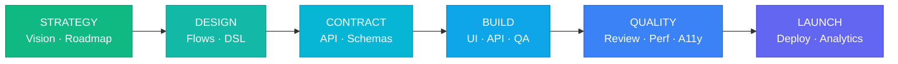

<p align="center">
  
  
  
  
  
</p>

<h1 align="center">Crew</h1>
<h3 align="center">Phase-Based Development Workflow for Claude Code</h3>

<p align="center">
  <strong>20 specialised agents. 6 phases. First-class Gang integration.</strong><br/>
  Drives features from strategy to launch through scoped agents and file-based handoffs —
  with explicit phase gates, contract-first development, and acceptance testing.
</p>

<p align="center">
  <code>/crew onboard</code>
</p>

---

## Quick Start

```bash
# 1. Add the marketplace
claude plugin marketplace add ebnrdwan/Crew

# 2. Install the plugin
claude plugin install crew

# 3. Run on any project
/crew onboard          # existing codebase — auto-detects state, sets phase
/crew init             # new project — starts at Phase 1

# Update to latest version
claude plugin marketplace update crew-marketplace
```

---

## How It Works



| Phase | Focus | Key Agents |
|---|---|---|
| **1. Strategy** | Vision, personas, roadmap | `product-strategist`, `feature-planner` |
| **2. Design** | Flows, design tokens, hi-fi screens | `ux-designer`, `dsl-generator` |
| **2.5. Contract** | API single source of truth | `api-contract-architect` |
| **3. Build** | Frontend + backend + QA in parallel | `ui-engineer`, `api-engineer`, `qa-engineer`, `pm-maestro-reviewer` |
| **4. Quality** | Review, perf, a11y, gap audit | `code-reviewer`, `performance-optimizer`, `a11y-expert`, `gap-finder` |
| **5/6. Launch** | Deploy, analytics, i18n | `devops-engineer`, `post-launch-analyst`, `i18n-engineer` |

Each phase has explicit completion criteria and requires user approval before advancing.

---

## Commands

| Command | What it does |
|---|---|
| `/crew` | Show subcommands and current project status |
| `/crew init` | Initialise a new project at Phase 1 |
| `/crew onboard` | Onboard an existing codebase — detect type, audit, set phase |
| `/crew feature [name]` | Add a feature, create branches, assign agents |
| `/crew setup-mcp [tool]` | Connect external tools (Jira, Notion, Linear, GitHub, …) |
| `/crew drive [name]` | End-to-end product-led feature dev (pm-architect → build → QA → audit) |
| `/crew deploy [flags]` | Pre-deployment checklist with auto-remediation |
| `/crew gaps [url]` | UI gap audit + auto-fix pipeline |
| `/crew features [filters]` | Roadmap dashboard with status, pages, acceptance progress |
| `/crew gang-import <slug>` | Import a Gang GO Package as a Crew feature |
| `/crew gang-escalate <id>` | Send a stalled Crew feature back to Gang for re-scoring |

---

## 20 Specialised Agents

| Phase | Agents |
|---|---|
| **1. Strategy** | `product-strategist`, `feature-planner` |
| **2. Design** | `ux-designer`, `dsl-generator` |
| **2.5. Contract** | `api-contract-architect` |
| **3. Build** | `ui-engineer`, `api-engineer`, `qa-engineer`, `pm-maestro-reviewer` |
| **4. Quality** | `code-reviewer`, `performance-optimizer`, `a11y-expert`, `gap-finder`, `ui-animation-designer` |
| **5. Launch** | `devops-engineer`, `post-launch-analyst` |
| **6. Enhancement** | `i18n-engineer` |
| **Cross-cutting** | `doc-writer`, `pm-architect` |
| **Gang ↔ Crew** | `gang-bridge` |

The `ui-engineer` handles React, React Native, SwiftUI, and Jetpack Compose from a single styled DSL — cross-platform consistency without duplicate agents.

---

## Gang Integration

Crew works **better when paired with [Gang](https://github.com/ebnrdwan/GangPlugin)** — a 6-stage strategic committee plugin (PM, Market, Finance, Architect, Domain Expert, CEO/CTO Advisor) that produces an evidence-backed GO Package.

```
Gang answers:  "Should we build it?"   → produces GO Package
Crew  answers: "How do we ship it?"     → consumes GO Package
```

### Lifecycle

1. **Gang evaluates** — produces BRD, charter, risk register, API contracts, verdict (GO / CONDITIONAL-GO / NO-GO)
2. **`/crew gang-import <slug>`** — `gang-bridge` agent translates GO Package into Crew roadmap, preserving CONDITIONAL-GO conditions as phase-3 gates
3. **Crew executes** — phases 2–5 with the right agents per phase
4. **`/crew gang-escalate <slug>`** — if execution reveals new evidence that contradicts the verdict, send back to Gang for re-scoring

### Artifact overlap

Both systems produce BRDs, architecture docs, API contracts, personas, design tokens, and risk registers. The **[overlap & handoff contract](plugin/skills/crew/references/overlap-handoff-contract.md)** specifies, per zone, whether `gang-bridge` imports the artifact (Crew agent skips), seeds it (Crew agent refines), or leaves it absent (Crew agent runs from scratch).

Full lifecycle docs: **[gang-integration.md](plugin/skills/crew/references/gang-integration.md)**

**Requirements:** Gang plugin v1.3.0+ installed at `~/.claude/plugins/marketplaces/gang-marketplace/`.

---

## Project Types

Crew detects and adapts to project type — phase instructions, agent selection, and roadmap structure all change accordingly.

| Type | Frontend | Backend | Notes |
|---|---|---|---|
| `fullstack` | ✓ | ✓ | Parallel frontend/backend dev |
| `frontend_only` | ✓ | — | Pages, components, flows |
| `backend_only` | — | ✓ | Endpoints, services, modules |
| `mobile` | ✓ | ✓ | React Native, SwiftUI, Jetpack Compose |

---

## Key Artifacts

| File | Purpose |
|---|---|
| `.crew/project-context.md` | Business goals, tech stack, architecture |
| `.crew/roadmap.yaml` | Feature roadmap and sprint planning |
| `.crew/current-phase.yaml` | Phase state tracker |
| `.crew/imports.yaml` | Gang→Crew handoff audit trail |
| `docs/api-contract.md` | API single source of truth |
| `design-artifacts/styled-dsl.yaml` | Component specs with styling |
| `docs/acceptance-reports/` | Maestro acceptance test results |

---

## Differences from archflow

Crew is a deliberate fork of [archflow v1.2.3](https://github.com/azidan/archflow). The fork is **strictly additive**:

| Area | archflow 1.2.3 | crew 0.1.0 |
|---|---|---|
| Slash command | `/archflow` | `/crew` |
| State directory | `.archflow/` | `.crew/` (lets Crew + Gang coexist) |
| Subcommands | `init`, `onboard`, `feature`, `setup-mcp` | + `drive`, `deploy`, `gaps`, `features`, `gang-import`, `gang-escalate` |
| Agents | 17 engineering agents | + `gap-finder`, `pm-architect`, `gang-bridge` (20 total) |
| Gang integration | manual copy/paste | first-class via `gang-bridge` agent |
| CONDITIONAL-GO gating | documented only | enforced — phase-3 won't unlock until conditions validated |

If you don't need Gang integration or the new commands, [archflow upstream](https://github.com/azidan/archflow) is the simpler choice.

---

## Documentation

- **[docs/index.html](docs/index.html)** — landing page with full visual overview
- **[plugin/skills/crew/references/gang-integration.md](plugin/skills/crew/references/gang-integration.md)** — Gang ↔ Crew lifecycle
- **[plugin/skills/crew/references/overlap-handoff-contract.md](plugin/skills/crew/references/overlap-handoff-contract.md)** — artifact skip rules
- **[CHANGELOG.md](CHANGELOG.md)** — version history

---

## License

MIT — fork modifications © ebnrdwan, original work © AZidan. See [LICENSE](LICENSE).
